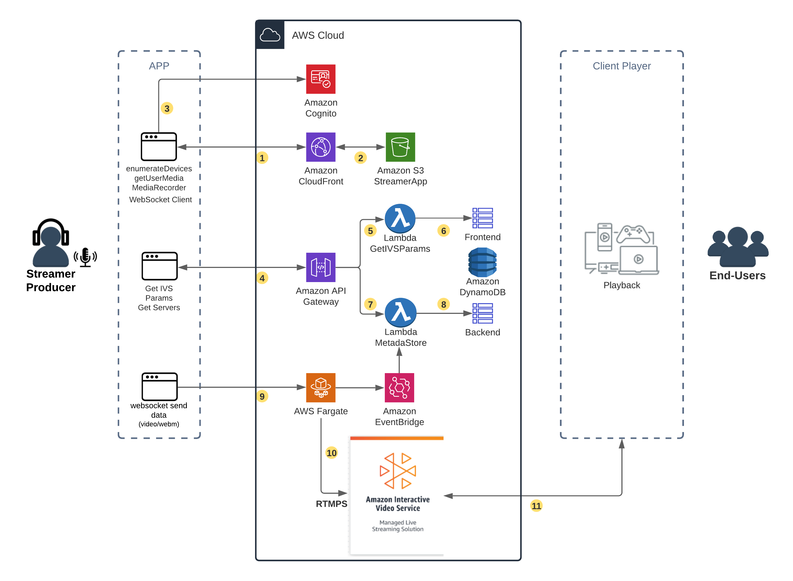
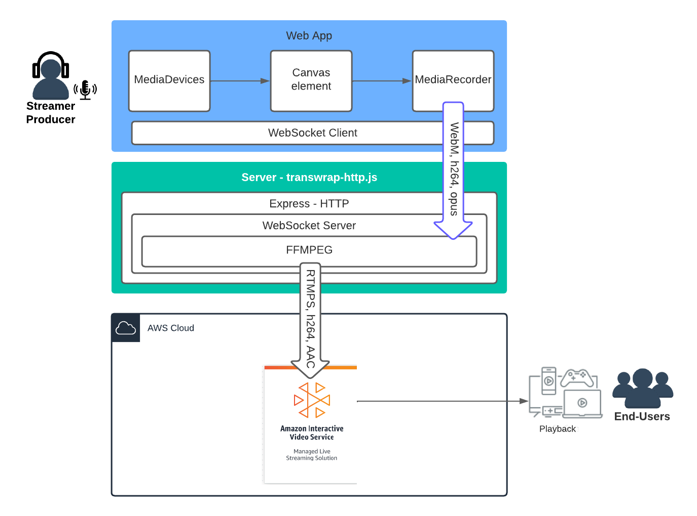

# Simplifying live streaming 
 
This solution simplifies live streaming by using the browser APIs and webRTC to capture video. It breaks down the process into smaller, independent blocks. It captures video from cameras and converts it into RTMPS format. This RTMPS video is then sent to Amazon Interactive Video Service (IVS) for streaming. 
Overall, it helps make live streaming easier and more streamlined.
(Amazon Interactive Video Service(https://aws.amazon.com/ivs/))

## IVS Solution Architecture

## Solution Includes:
1. Broadcaster app: It's an application that uses basic browser features to capture audio and video. It sends the captured data to a server using web sockets. It also utilizes AWS Amplify, a tool that helps build scalable applications.

2. Amazon IVS: It's a ready-to-use live streaming solution provided by Amazon. It enables easy setup and creation of interactive video experiences.

3. Proxy video transwrap: This application uses Node.js to create a secure server for WebSocket communication. It also uses FFmpeg, a multimedia framework, to convert the video stream into the RTMPS format required by Amazon IVS.

In simple terms, the solution includes an app to capture audio and video, a service for live streaming provided by Amazon, and a tool to convert and transmit the video stream to Amazon IVS.  

## Please note that this project is designed for educational purposes and not for actual production usage. 
It is meant for testing and to help accelerate your understanding of cloud adoption. 
If you require a custom solution for large-scale production events, please contact your AWS representative for more information.
[click or here](https://pages.awscloud.com/Media-and-Entertainment-Contact-Us.html)

This is a serverless application that utilizes various AWS services such as [Amazon IVS](https://aws.amazon.com/ivs), [AWS Amplify](https://aws.amazon.com/amplify/), [Amazon API Gateway](https://aws.amazon.com/api-gateway/), [AWS Lambda](https://aws.amazon.com/lambda/), [Amazon DynamoDB](https://aws.amazon.com/dynamodb), [Amazon S3](https://aws.amazon.com/s3/). 
The user interface of the web application is built using React.js.

## -->Deployment options:
:warning: **NOTE:-->** Deploying this demo application in your AWS account will create and consume AWS resources. 

### --->video_camera: [1. To deploy the application API's and run the client app locally](/frontend/README.md)
We will need to deploy the API's, Lambda Functions and Authentication resources, we will use AWS Amplify.

###--->rocket: [2. Deployment of the Proxy AWS Fargate and web App Publish](/backend/README.md)
This is an **optional step** to provisione a ECS Docker Container to work a remote transwrap proxy, that will translate from WebRTC to RTMPS.

## Simplifying live streaming contribution - run locally.
This sample demo application, captures the video and use a proxy in node.js to transwrap the stream to  Amazon IVS

*Detailed Video Workflow:*

The server - transwrap-http.js can be local or remote, according to the steps that you will follow.
For improving browser compatibility, the video element was embedded in a canvas element, as HTMLMediaElement.captureStream() has limited support. HTMLCanvasElement.captureStream() compatibility can be observed in the link [captureStream()](https://developer.mozilla.org/en-US/docs/Web/API/HTMLCanvasElement/captureStream)

## Next step
[Deploy application backend API's and run client app in your localhost](/frontend/README.md)

## Additional guides in this repository
**Note:** Before deployment Replace REPLACE_ACCOUNTID with your AWS account id in json_configs/****policy.json

* [**Backend: Transwraping Amazon ECS container:**](/backend/README.md)Install  the remote video transwrap server.
* [**Create a IVS Channel using a shell script**](/backend/CREATEIVS.md)
* [**Customize the web app and compatibility discussions**](frontend/BROWSER.md)

## Notice
This project uses FFMPG, http://www.ffmpeg.org, please check lisensing usage.

## Security
See [CONTRIBUTING](CONTRIBUTING.md#security-issue-notifications) for more information.

## License
This library is licensed under the MIT-0 License. See the LICENSE file.